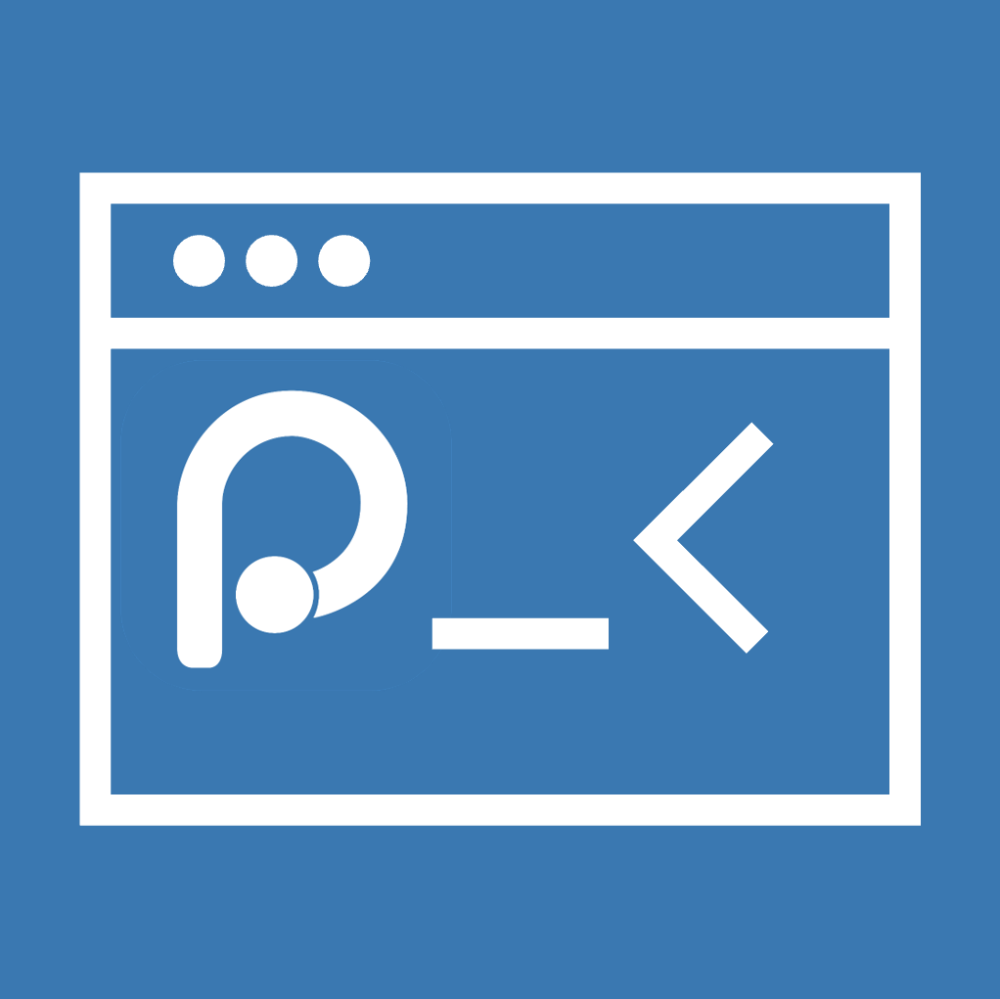

# Positron Console MCP 

[](https://open-vsx.org/extension/davidrsch/positron-console-mcp)

MCP (Model Context Protocol) server that gives AI coding assistants first-class access to **Positron Console** — the interactive coding environment used by [Positron IDE](https://github.com/posit-dev/positron) for R, Python, and data science workflows.

Modeled after the proven architecture of [terminal-automatization](https://github.com/davidrsch/vscode_terminal_automatization), this extension replaces raw terminal automation with structured runtime session management, code execution with observer-pattern output capture, session variable introspection, and more.

## Features

- **12 MCP Tools** for console/session/runtime management
- **Execute code** in R or Python sessions with full observer lifecycle (onStarted → onOutput → onCompleted → onFinished)
- **Structured output capture** — MIME data maps (text, HTML, plots, tables, errors)
- **Session management** — list, focus, and inspect active runtime sessions
- **Variable introspection** — retrieve session variables (R data frames, Python variables, etc.)
- **Connection management** — register database/data-source drivers
- **Editor integration** — get active editor context and selections
- **Viewer pane** — open URLs/HTML in the Positron Viewer
- **Graceful degradation** — works in standard VS Code with clear error messages
- **Auto-registration** — appears in **Extensions → MCP SERVERS → Installed** with logo

## Requirements

- **Positron IDE** 2025.6.0 or later (provides the `@posit-dev/positron` runtime API)
- Can also run in standard VS Code — tools will return clear "Positron API not available" errors

## Tools

12 MCP tools organized into three groups: Console / Session, Runtime & Environment, and IDE Integration.

---

### 1. `list_consoles`

List all active Positron runtime sessions (consoles).

| Aspect        | Value                                        |
| ------------- | -------------------------------------------- |
| **Arguments** | None                                         |
| **Returns**   | `{ consoles: ConsoleInfo[], count: number }` |

---

### 2. `get_active_console`

Get the currently active (foreground) Console session.

| Aspect        | Value                                                      |
| ------------- | ---------------------------------------------------------- |
| **Arguments** | None                                                       |
| **Returns**   | `{ activeConsole: ConsoleInfo \| null, message?: string }` |

---

### 3. `focus_console`

Switch the foreground session to a specific Console.

| Aspect        | Value                                                                             |
| ------------- | --------------------------------------------------------------------------------- |
| **Arguments** | `sessionId?: string` — session ID to focus<br>`index?: number` — zero-based index |
| **Returns**   | `{ focused: boolean, sessionId?: string, error?: string }`                        |

---

### 4. `execute_code`

Execute code in a Positron Console with full observer-based output capture.

| Aspect        | Value                                                                                                                                                                                                                                                                   |
| ------------- | ----------------------------------------------------------------------------------------------------------------------------------------------------------------------------------------------------------------------------------------------------------------------- |
| **Arguments** | `code: string` (required) — code to execute<br>`languageId?: 'python' \| 'r'` — auto-resolves from session if omitted<br>`sessionId?: string` — target session<br>`allowIncomplete?: boolean` — default `false`<br>`timeoutMs?: number` — default `60000`, max `300000` |
| **Returns**   | `{ code, languageId, outputs[], result?, error?, timedOut? }`                                                                                                                                                                                                           |
| **Notes**     | Outputs are truncated at 500 KB per entry and 200 total entries                                                                                                                                                                                                         |

---

### 5. `get_session_variables`

Get variables defined in a Console session (R data frames, Python variables, etc.).

| Aspect        | Value                                                 |
| ------------- | ----------------------------------------------------- |
| **Arguments** | `sessionId?: string` — defaults to foreground session |
| **Returns**   | `{ sessionId: string, variables: object }`            |

---

### 6. `get_preferred_runtime`

Get the user's preferred runtime for a given language.

| Aspect        | Value                                                            |
| ------------- | ---------------------------------------------------------------- |
| **Arguments** | `languageId: string` (required) — e.g. `"python"`, `"r"`         |
| **Returns**   | `{ runtimeName: string, runtimeId: string, languageId: string }` |

---

### 7. `create_connection`

Register a database/data-source connection driver and connect.

| Aspect        | Value                                                                                                                                         |
| ------------- | --------------------------------------------------------------------------------------------------------------------------------------------- |
| **Arguments** | `driverId: string` (required)<br>`inputs?: { id, label, type, value }[]`<br>`name?: string`<br>`languageId?: string` — defaults to `"python"` |
| **Returns**   | `{ success: boolean, driverId: string, name?: string, error?: string }`                                                                       |

---

### 8. `get_console_width`

Get the current Console panel width in characters (for formatting output).

| Aspect        | Value               |
| ------------- | ------------------- |
| **Arguments** | None                |
| **Returns**   | `{ width: number }` |

---

### 9. `set_environment_variable`

Set, append, prepend, or unset environment variables in Positron session environments.

| Aspect        | Value                                                                                                                       |
| ------------- | --------------------------------------------------------------------------------------------------------------------------- |
| **Arguments** | `name: string` (required)<br>`value: string`<br>`action?: 'set' \| 'unset' \| 'append' \| 'prepend'` — default `"set"`      |
| **Returns**   | `{ action, name, value?, mutatorType?, success: boolean }`                                                                  |
| **Notes**     | Uses `EnvironmentVariableMutatorType` (Replace=1, Append=2, Prepend=3). Changes take effect when new sessions are launched. |

---

### 10. `get_editor_context`

Get the currently active editor file path and text selection.

| Aspect        | Value                                                                                          |
| ------------- | ---------------------------------------------------------------------------------------------- |
| **Arguments** | None                                                                                           |
| **Returns**   | `{ document?: { path, languageId }, selection?: string } \| { editor: null, message: string }` |

---

### 11. `open_viewer`

Open a URL or HTML content in the Positron Viewer pane.

| Aspect        | Value                    |
| ------------- | ------------------------ |
| **Arguments** | `url: string` (required) |
| **Returns**   | `{ opened: string }`     |

---

### 12. `get_plot_settings`

Get current plot rendering dimensions.

| Aspect        | Value                                                         |
| ------------- | ------------------------------------------------------------- |
| **Arguments** | None                                                          |
| **Returns**   | `{ width: number, height: number, ... } \| { error: string }` |

## Installation

The MCP server auto-registers when the extension activates — no manual configuration needed. After installing from Open VSX, it appears under:

> **Extensions → MCP SERVERS → Installed**

The logo from `logo.png` is shown in the panel tile.

### Manual configuration (fallback)

If the extension doesn't auto-register in your VS Code version, add this to `.vscode/mcp.json`:

```json
{
  "servers": {
    "positron-console-mcp": {
      "type": "http",
      "url": "http://localhost:6071/mcp",
      "serverName": "positron-console-mcp"
    }
  }
}
```

Or run **Console MCP: Copy MCP Configuration** from the Command Palette.

## Configuration

| Setting                   | Default | Description                                                                              |
| ------------------------- | ------- | ---------------------------------------------------------------------------------------- |
| `positronConsoleMcp.port` | `0`     | MCP server port. `0` = OS-assigned random free port (recommended — avoids all conflicts) |

When set to `0`, the OS picks a free port and `McpHttpServerDefinition` auto-discovers it — no manual setup needed. Set an explicit port only if you're using the manual `.vscode/mcp.json` fallback.

## Architecture

This MCP server uses the **Streamable HTTP** transport (spec 2025-03-26) in **stateless** mode. Each request creates a fresh `McpServer` instance — no session state is stored on the server. The Positron runtime itself maintains Console session state, keeping the transport layer simple and avoiding session-management complexity.

- **Stateless per-request** — each `tools/call` creates a new MCP server instance
- **Streamable HTTP** — uses `StreamableHTTPServerTransport` with stateless mode
- **Rate limiting** — 120 req/min per IP with automatic cleanup
- **Payload validation** — 5 MB limit, Zod schemas for all tool arguments
- **Port auto-retry** — tries ports 6071–6079 on `EADDRINUSE`

## Security

The MCP server listens only on `localhost` and validates the `Host` header. The `execute_code` tool runs arbitrary code in your Positron sessions — same trust model as `run_command` in AI coding assistants. Only connect trusted MCP clients.

## Commands

| Command                                  | Description                                                |
| ---------------------------------------- | ---------------------------------------------------------- |
| **Console MCP: Show Status**             | Display server port, MCP endpoint, and Positron API status |
| **Console MCP: Copy MCP Configuration**  | Copy `.vscode/mcp.json` snippet to clipboard               |
| **Console MCP: Add to .vscode/mcp.json** | Auto-add the server to the workspace `mcp.json` file       |
| **Console MCP: Restart Server**          | Stop and restart the MCP HTTP server                       |

## Development

```bash
npm install
npm run build
npm test
npm run package   # creates .vsix
```

## License

MIT
